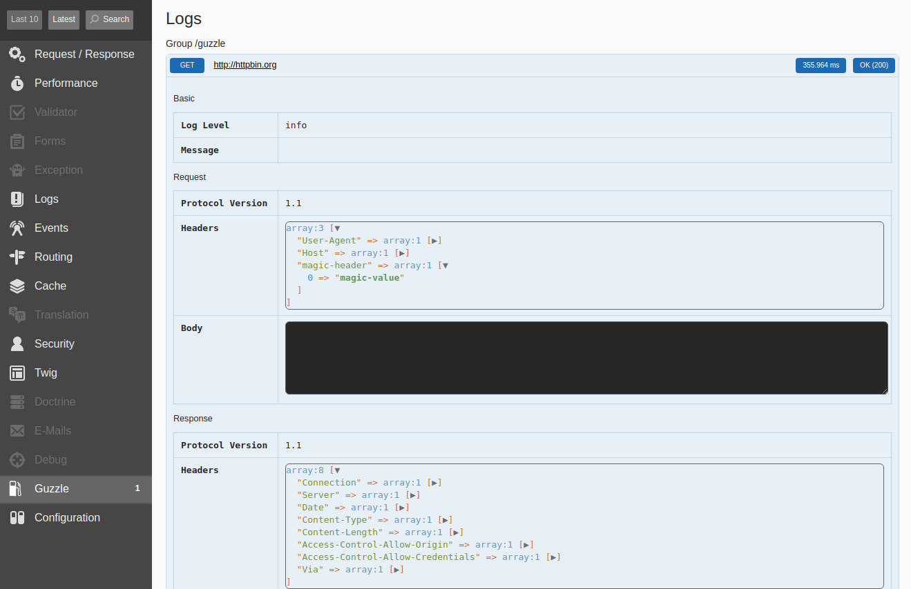

# How to create a single-file plugin

The possibility of creating plugins was introduced in version [7.0][1] of Guzzle Bundle and several plugins have already been published and downloaded thousands of times.

Let’s see how easy it is to create your own single-file plugin!

### Middleware

> If you are not familiar with `middleware` definition, then first read this great article provided by Guzzle team: 
> [http://docs.guzzlephp.org/en/stable/handlers-and-middleware.html#middleware][6]

The primary goal of plugins is to provide possibility of configuration of middlewares for each guzzle client individually.

So, first we need a middleware. Suppose we have one that adds some "magic header" with "magic value" to all the requests:

```php
// src/GuzzleMiddleware/MagicHeaderMiddleware.php

namespace App\GuzzleMiddleware;

use Psr\Http\Message\RequestInterface;

class MagicHeaderMiddleware
{
    private $magicHeaderValue;

    /**
     * @param $magicHeaderValue
     */
    public function __construct($magicHeaderValue)
    {
        $this->magicHeaderValue = $magicHeaderValue;
    }

    /**
     * @param callable $handler
     *
     * @return \Closure
     */
    public function __invoke(callable $handler) : \Closure
    {
        return function (
            RequestInterface $request,
            array $options
        ) use ($handler) {
            $request = $request->withHeader('magic-header', $this->magicHeaderValue);

            // Continue the handler chain.
            return $handler($request, $options);
        };
    }
}
```

### Client

Also we need a guzzle client, that will be used to perform requests:

```yaml
# config/packages/eight_points_guzzle.yaml

eight_points_guzzle:
    clients:
        httpbin_client:
            base_url: "http://httpbin.org"

            plugin: ~
```

Now it’s time to connect middleware with the client through plugin system!

```yaml
# config/packages/eight_points_guzzle.yaml

eight_points_guzzle:
    clients:
        httpbin_client:
            base_url: "http://httpbin.org"

            plugin:
                magic_header:
                    header_value: magic-value
```

Adjust your configuration file and try to clear cache using command `bin/console cache:clear` and you will observe an error:

```bash
In ArrayNode.php line 311:
Unrecognized option "magic_header" under "eight_points_guzzle.clients.httpbin_client.plugin"  
```

It’s OK, because Guzzle Bundle does not know anything about `magic_header` plugin and such a configuration.
The plugin we plan to make will help Guzzle Bundle to do it.

### Plugin

Create plugin file:

```php
// src/GuzzlePlugin/MagicHeaderPlugin.php

namespace App\GuzzlePlugin;

use EightPoints\Bundle\GuzzleBundle\PluginInterface;
use Symfony\Component\Config\Definition\Builder\ArrayNodeDefinition;
use Symfony\Component\DependencyInjection\ContainerBuilder;
use Symfony\Component\DependencyInjection\Definition;
use Symfony\Component\HttpKernel\Bundle\Bundle;

class MagicHeaderPlugin extends Bundle implements PluginInterface
{
    /**
     * @return string
     */
    public function getPluginName() : string
    {

    }

    /**
     * @param ArrayNodeDefinition $pluginNode
     */
    public function addConfiguration(ArrayNodeDefinition $pluginNode)
    {

    }

    /**
     * @param array $config
     * @param ContainerBuilder $container
     * @param string $clientName
     * @param Definition $handler
     */
    public function loadForClient(array $config, ContainerBuilder $container, string $clientName, Definition $handler)
    {

    }

    /**
     * @param array $configs
     * @param ContainerBuilder $container
     */
    public function load(array $configs, ContainerBuilder $container)
    {

    }
}
```

Note that we implemented `PluginInterface` interface and defined 4 methods:
- `load` - used to load xml/yaml/etc configuration
- `loadForClient` - called after clients services are defined in container builder
- `addConfiguration` - called when configuration tree of Guzzle Bundle is being built
- `getPluginName` - called to get plugin identifier *(plugin name)*

First define plugin name:

```php
// ...

class MagicHeaderPlugin extends Bundle implements PluginInterface
{    
    /**
     * @return string
     */
    public function getPluginName() : string
    {
        return 'magic_header';
    }
    
    // ...
}
```

Next add possibility to configure `header_value` value in configuration file:

```php
// ...

class MagicHeaderPlugin extends Bundle implements PluginInterface
{
    // ...

    /**
     * @param ArrayNodeDefinition $pluginNode
     */
    public function addConfiguration(ArrayNodeDefinition $pluginNode)
    {
        $pluginNode
            ->addDefaultsIfNotSet()
            ->children()
                ->scalarNode('header_value')->defaultNull()->end()
            ->end();
    }
    
    // ...
}
```

During the construction of configuration tree of Guzzle Bundle the node is created for each plugin and this node is passed to each plugin in `addConfiguration` method.
Here you have possibility to add any nodes you want. In out case we added just one scalar and nullable node with key `header_value`.

You can read more about configuration [here][2].

### Connect Plugin with Guzzle Bundle

The plugin does not do anything significant, but it is ready to be connected to Guzzle Bundle:

```diff
  // src/Kernel.php
  
  // ...
+ use App\GuzzlePlugin\MagicHeaderPlugin;
  
  class Kernel extends BaseKernel
  {
      // ...
  
      public function registerBundles()
      {
          $contents = require $this->getProjectDir().'/config/bundles.php';
          foreach ($contents as $class => $envs) {
              if (isset($envs['all']) || isset($envs[$this->environment])) {
-                 yield new $class();
+                 if ($class === \EightPoints\Bundle\GuzzleBundle\EightPointsGuzzleBundle::class) {
+                     yield new $class([
+                         new MagicHeaderPlugin(),
+                     ]);
+                 } else {
+                     yield new $class();
+                 }
              }
          }
      }
  
      // ...
  }
```

Clearing of cache will end with success.

### Connect Plugin with Middleware

To connect the plugin and middleware we need to modify `loadForClient` method from `MagicHeaderPlugin` class.
At this stage we get control over the process of building the container.
Having the value of `header_value` option provided from configuration file we can define middleware as a service and inject it to handler stack of the client:

```php
// ...
use Symfony\Component\ExpressionLanguage\Expression;
use App\GuzzleMiddleware\MagicHeaderMiddleware;

class MagicHeaderPlugin extends Bundle implements PluginInterface
{
    // ...
    
    /**
     * @param array $config
     * @param ContainerBuilder $container
     * @param string $clientName
     * @param Definition $handler
     */
    public function loadForClient(array $config, ContainerBuilder $container, string $clientName, Definition $handler)
    {
        if ($config['header_value']) {
            // Create DI definition of middleware
            $middleware = new Definition(MagicHeaderMiddleware::class);
            $middleware->setArguments([$config['header_value']]);
            $middleware->setPublic(true);

            // Register Middleware as a Service
            $middlewareServiceName = sprintf('guzzle_bundle_magic_header_plugin.middleware.magic_header.%s', $clientName);
            $container->setDefinition($middlewareServiceName, $middleware);

            // Inject this service to given Handler Stack
            $middlewareExpression = new Expression(sprintf('service("%s")', $middlewareServiceName));
            $handler->addMethodCall('unshift', [$middlewareExpression]);
        }
    }
    
    // ...
}
```

Note that `loadForClient` method is executed for each client defined in `eight_points_guzzle` configuration file.

Read more about handler stack [here][6].

### Testing

It’s time to test!

Just call anywhere the client and execute GET request:

```php
$this->get('eight_points_guzzle.client.httpbin_client')->get('');
```

Trigger this action and open Symfony Profiler:



Note in the request information the header with name `magic-header` and value provided from configuration: `magic-value`.

### Conclusion

In this article we found out how easy it is to create single-file plugin and to extend base functionality provided by Guzzle Bundle.

In the next article, we'll figure out how to create standalone plugin ready to be published on [packagist.org][3].

### Additional information

- [Known and Supported Guzzle Bundle Plugins][4]
- [More Guzzle Middlewares][5]

[1]: https://github.com/8p/EightPointsGuzzleBundle/releases/tag/v7.0.0
[2]: https://symfony.com/doc/current/components/config/definition.html
[3]: https://packagist.org
[4]: https://github.com/8p/EightPointsGuzzleBundle#known-and-supported-plugins
[5]: https://packagist.org/?query=middleware&tags=guzzle~middleware
[6]: http://docs.guzzlephp.org/en/stable/handlers-and-middleware.html#handlerstack
[7]: http://docs.guzzlephp.org/en/stable/handlers-and-middleware.html#middleware
